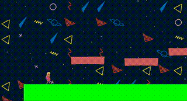
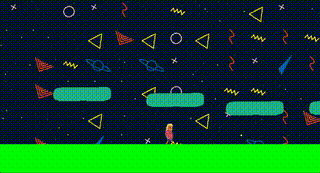

# BEACH BUM (wip)
This is a simple 2D game engine written in C++ using SDL2. 
I'm working on this as a learning experience to get a better understanding of how game engines work, specifically graphics/rendering. 
Also, I love video games and I came up with this little character a while back, so I wanted to use him for something.
The platforms and background are procedurally generated, so the game is different on each run. The player can move left and right,
and jump. If the player falls off the ground, they will respawn at the starting position. It's really just a minimum viable platformer.

It is a work in progress and is not yet ready for use.

Here are some gifs of the current progress: 



a different background and set of platforms is generated on this run:



## Installation
This project uses [vcpkg](https://github.com/microsoft/vcpkg).

To build the project run:
```shell
chmod +x build.sh
```
```shell
./build.sh
```